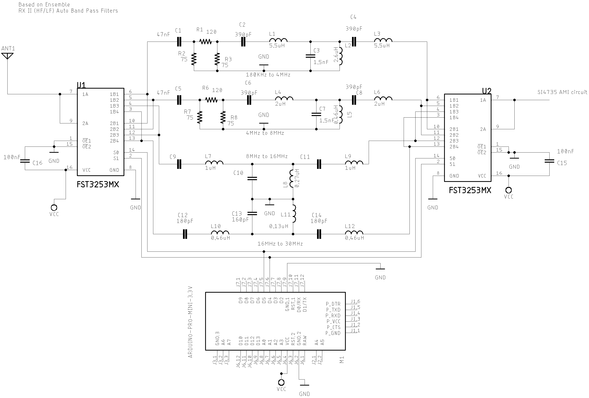
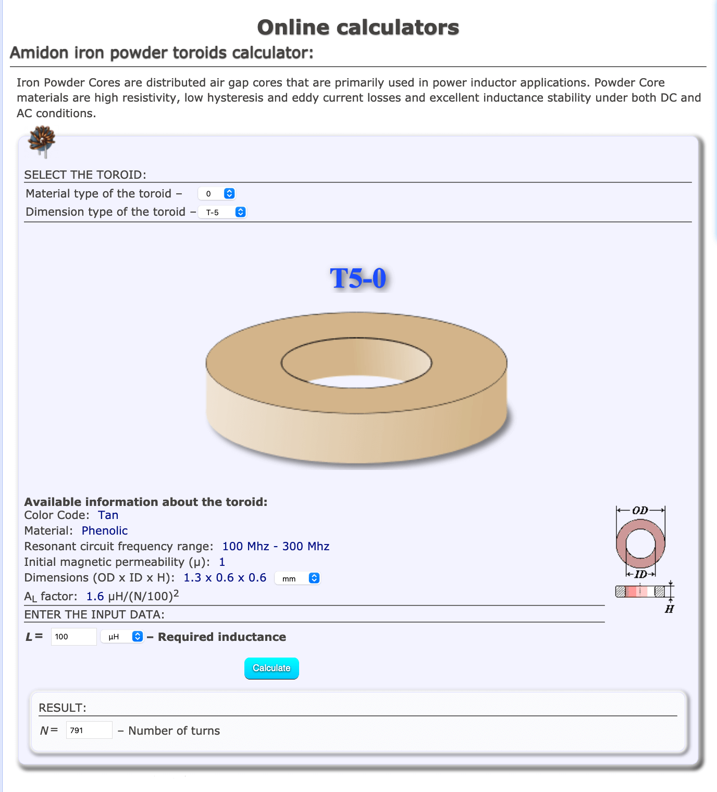
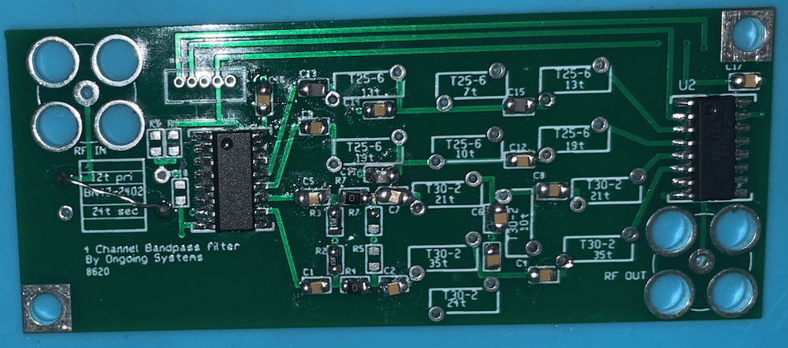

# [Band Pass Filter controlled by Arduino](https://pu2clr.github.io/auto_bpf_arduino/)

It is a HF band pass filter controlled by Arduino. It is designed for HF receivers. 
With this project, you can use a set of up to four HF bandpass filters that can be selected by Arduino. 
To do that you will need just two digital Arduino pins.

This project includes a bandpass filter design based on [“Softrock Ensemble RX II (HF/LF) Auto Band Pass Filters“](http://www.wb5rvz.org/ensemble_rx_ii/index), an Arduino Library to control the filter, documentation and examples. 

Mr. Jim Regan, W0CHL, did a great job on auto bandpass filter. I recommend his design. Please, check Reagan's documentation on [https://github.com/JimReagans/Si4735-radio-PCB-s-and-bandpass-filter](https://github.com/JimReagans/Si4735-radio-PCB-s-and-bandpass-filter)


All Arduino source code found here can be __freely distributed using the MIT Free Software model__. 

[Copyright (c) 2019 Ricardo Lima Caratti](https://pu2clr.github.io/auto_bpf_arduino/#mit-license). 

## Be a member

There is a __Facebook__ group called [__Si47XX for Radio Experimenters__](https://www.facebook.com/groups/532613604253401/) where the purpose is exchanging experiences with projects based on Silicon Labs  SI47XX IC family. You will be welcome to the group [Si47XX for Radio Experimenters](https://www.facebook.com/groups/532613604253401/).


## Contents 

1. [Preface](https://pu2clr.github.io/auto_bpf_arduino/#preface)
2. [Schematic](https://pu2clr.github.io/auto_bpf_arduino/schematic)
3. [Customizing LC bandpass filter L and C pairs calculation](https://pu2clr.github.io/auto_bpf_arduino/#customizing-lc-bandpass-filter-l-and-c-pairs-calculation)
   * [LC bandpass filter L and C pairs calculation](https://pu2clr.github.io/auto_bpf_arduino/#lc-bandpass-filter-l-and-c-pairs-calculation) 
   * [Toroids and Inductor Formula](https://pu2clr.github.io/auto_bpf_arduino/#toroids-and-inductor-formula)
4. [Arduino Driver for Auto Band Pass filters](https://pu2clr.github.io/auto_bpf_arduino/#arduino-driver-for-auto-band-pass-filters)
   * Sketch setup
   * How to test your filter
   * [Source code](https://github.com/pu2clr/auto_bpf_arduino/tree/master/Arduino)
5. [Photos](https://pu2clr.github.io/auto_bpf_arduino/#photos)
6. [References](https://pu2clr.github.io/auto_bpf_arduino/#references)


## Preface

Originally based on the [“Softrock Ensemble RX II (HF/LF) Auto Band Pass Filters“](http://www.wb5rvz.org/ensemble_rx_ii/index) by WB5RVZ, this project uses an Arduino controller instead an ATtiny85. I have developed an Arduino Library to control the Auto Band Pass filter device. You can see that on [Arduino/pu2clr_autobpf_driver](https://github.com/pu2clr/auto_bpf_arduino/tree/master/Arduino/pu2clr_autobpf_driver) folder. 

The RF input and output of the original filter has been modified to be easily attached to the SI4735, AKC6955, KT0915 and others DSP based receivers istead the [SoftRock Ensemble RX II device](http://www.wb5rvz.org/ensemble_rx_ii/index?projectId=16). 

Mr. Jim Regan, W0CHL, did a great job on auto bandpass filter. I recommend his design. Please, check Reagan's documentation on [https://github.com/JimReagans/Si4735-radio-PCB-s-and-bandpass-filter](https://github.com/JimReagans/Si4735-radio-PCB-s-and-bandpass-filter). 


### The videos below show an example of the Auto bandpass filter working.

[HF Auto Bandpass filter controlled by Arduino (first test)](https://youtu.be/M1PDRzVvAm0)



<BR>

[HF auto bandpass filter controlled by Arduino (real test)](https://youtu.be/KuAmm0LjUGA)




## MIT License 

Copyright (c) 2019 Ricardo Lima Caratti

Permission is hereby granted, free of charge, to any person obtaining a copy of this software and associated documentation files (the "Software"), to deal in the Software without restriction, including without limitation the rights to use, copy, modify, merge, publish, distribute, sublicense, and/or sell copies of the Software, and to permit persons to whom the Software is furnished to do so, subject to the following conditions:

The above copyright notice and this permission notice shall be included in all copies or substantial portions of the Software.

THE SOFTWARE IS PROVIDED "AS IS", WITHOUT WARRANTY OF ANY KIND, EXPRESS OR IMPLIED, INCLUDING BUT NOT LIMITED TO THE ARRANTIES OF MERCHANTABILITY, FITNESS FOR A PARTICULAR PURPOSE AND NONINFRINGEMENT. IN NO EVENT SHALL THE AUTHORS OR COPYRIGHT HOLDERS BE LIABLE FOR ANY CLAIM, DAMAGES OR OTHER LIABILITY, WHETHER IN AN ACTION OF CONTRACT, TORT OR OTHERWISE, ARISING FROM, OUT OF OR IN CONNECTION WITH THE SOFTWARE OR THE USE OR OTHER DEALINGS IN THE SOFTWARE.

<BR>


# SCHEMATIC

The schematic below uses two [FST3253](https://www.mouser.com/datasheet/2/149/FST3253-113358.pdf) or two [SN74CBT3253D](https://www.ti.com/lit/ds/symlink/sn74cbt3253.pdf?HQS=TI-null-null-mousermode-df-pf-null-wwe&ts=1596797600884&ref_url=https%253A%252F%252Fbr.mouser.com%252F) device switches to select one of four bandpass filters. It shows a set of four band pass filters (T section bandpass filter setup). Two Arduino pins are used to select the right filter depending on frequency. 





* Filter 0 (1800KHz to 4MHz )
  * L1 and L3: 4.6 uH; 35 turns; wire: #30; Toroid: T30-2(Red) 
  * L2: 1.3uH; 24 Turns; wire #30; Toroid T30-2(Red)

* Filter 1 (4MHz to 8MHz)
  * L4 and L6: 2.00 uH; 21 turns; wire: #30; Toroid: T30-2(Red)
  * L5: 0.46uH; 10 Turns; wire #30; Toroid T30-2(Red)

* Filter 2 (8MHz to 16MHz)
  * L7 and L9: 1uH; 19 turns; wire #30; Toroid T25-6(Yellow)
  * L8: 0.27uH: 10 turns; wire #30; Toroid T25-6 c(Yellow)

* Filter 3 (16MHz to 30MHz)
  * L10 and L12: 0.46uH: 13 turns; wire #30; Toroid T25-6 (Yellow)
  * L11: 0.13uH: 7 turns; wire #30;  Toroid T25-6 (Yellow).


## Customizing LC bandpass filter L and C pairs calculation

You can try other filters setup by calculating the components of each band pass filter.
The basic circuit below represents a generic band pass filter used by this project. 


### LC bandpass filter L and C pairs calculation


#### Where:  

* LX1, LX2 and LX3 are the inductors (indutance in Henries)
* CX1, CX2 and CX3 are the capacitors (capacitance in Farads) 
* fmax and fmin are cut off frequencies in Hertz
* Zo is the characteristic impedance in ohms

To check the most appropriate toroid for the inductor as well as the number of turns, see [Amidon iron powder toroids calculator](https://coil32.net/online-calculators/amidon-iron-powder-cores-calculator.html)


### Toroids and Inductor Formula

You can build your own inductor by using toroids. The formula to do that is shown below. 


__Where AL and N are the factor and number of turns respectively__. 


#### Toroids parameters: 

* Select the material type. It can tell you the resonant circuit frequency range. Generally you will get a correspondente color to the material. Check the resonant frequency range you want to work.
* Select the Dimension type of the toroid. Generally it is expressed by T-25, T-30, etc.
* L is the indutance (pay attention to the unit).
* N is the number of turns.


##### There is great tools to calculate the inductors by using toroids 



[Go to Amidon iron powder toroids calculator](https://coil32.net/online-calculators/amidon-iron-powder-cores-calculator.html)


## Arduino Driver for Auto Band Pass filters

If you are using Arduino, you can add in your sketch folder the files [AutoBPF.h and AutoBPF.cpp](https://github.com/pu2clr/auto_bpf_arduino/tree/master/Arduino/pu2clr_autobpf_driver). These files integrate the Arduino library for the Auto bandpass filter filter of this project. Check the folder 
[Arduino/pu2clr_autobpf_driver](https://github.com/pu2clr/auto_bpf_arduino/tree/master/Arduino/pu2clr_autobpf_driver).


In your main sketch you have to declare the AutoBPF library as shown below.

```cpp
#include "AutoBPF.h"    // Bandpass filter library

AutoBPF bpf;            // Declare the Auto bandpass filter class.

void setup()
{
   .
   .
   .
    bpf.setup(4, 5);    // Uses the Arduino pins 4 and 5 to select the desired filter
    bpf.setFilter(0);   // Setects the first filter of the Auto Band Pass Filter.
    .
    .
    bpf.setFilter(3);   // Setects the last filter of the Auto Band Pass Filter.
    .
    .
}
```


## Photos


The photos below show Jim Reagan's board design of the Auto Band Pass filter. You can find more details about it on [https://github.com/JimReagans/Si4735-radio-PCB-s-and-bandpass-filter](https://github.com/JimReagans/Si4735-radio-PCB-s-and-bandpass-filter). 

<BR>


<BR>



<BR>
<BR>

The photos below show the SI4732 based receiver with the Auto Band Pass Filter controlled by Arduino.

<BR> 


<BR>


### Know more about DSP receivers controlled by Arduino 

1. [PU2CLR Si4735 Library for Arduino](https://pu2clr.github.io/SI4735/). This library was built based on “Si47XX PROGRAMMING GUIDE; AN332” and it has support to FM, AM and SSB modes (LW, MW and SW). It also can be used on all members of the SI47XX family respecting, of course, the features available for each IC version;
2. [PU2CLR SI4844 Arduino Library](https://github.com/pu2clr/SI4844). This is an Arduino library for the SI4844, BROADCAST ANALOG TUNING DIGITAL DISPLAY AM/FM/SW RADIO RECEIVER,  IC from Silicon Labs.  It is available on Arduino IDE. This library is intended to provide an easier interface for controlling the SI4844.
3. [PU2CLR AKC695X Arduino Library](https://pu2clr.github.io/AKC695X/). The AKC695X is a family of IC DSP receiver from AKC technology. The AKC6955 and AKC6959sx support AM and FM modes. On AM mode the AKC6955 and AKC6959sx work on LW, MW and SW. On FM mode they work from 64MHz to 222MHz.
4. [PU2CLR KT0915 Arduino Library](https://pu2clr.github.io/KT0915/). The KT0915 is a full band AM (LW, MW and SW) and FM DSP receiver that can provide you a easy way to build a high quality radio with low cost.
5. [PU2CLR RDA5807 Arduino Library](https://pu2clr.github.io/RDA5807/). The RDA5807 is a FM DSP integrated circuit receiver (50 to 115MHz) with low noise amplifier support. This device requires very few external components if compared with other similar devices. It also supports RDS/RBDS functionalities, direct auto gain control (AGC) and real time adaptive noise cancellation function.
6. [PU2CLR SI470X Arduino Library](https://pu2clr.github.io/SI470X/). It is a Silicon Labs device family that integrates the complete functionalities for FM receivers, including RDS (Si4703).


## References

1. [SN74CBT3253DUAL 1-OF-4 FET MULTIPLEXER/DEMULTIPLEXER](https://www.ti.com/lit/ds/symlink/sn74cbt3253.pdf?HQS=TI-null-null-mousermode-df-pf-null-wwe&ts=1596797600884&ref_url=https%253A%252F%252Fbr.mouser.com%252F)
2. [FST3253Dual 4:1 Multiplexer/Demultiplexer Bus Switch](https://www.mouser.com/datasheet/2/149/FST3253-113358.pdf)
3. [Constant-K LC Band Pass Filter Circuit Design & Calculations](https://www.electronics-notes.com/articles/radio/rf-filters/constant-k-simple-bandpass-lc-rf-filter-design-calculations.php)
4. [LC Filters Design Tool](https://rf-tools.com/lc-filter/)
5. [Bandpass LC Filters](https://youtu.be/mv_T6eBp3Lk)
6. [Ensemble RX II (HF/LF)](http://www.wb5rvz.org/ensemble_rx_ii/index)
7. [Ensemble RX II (HF/LF) Auto Band Pass Filters](http://www.wb5rvz.org/ensemble_rx_ii/05_bpf)
